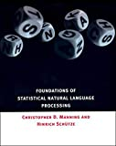

# 講義者からの推薦図書：ゲレ
## 関連講義
- [自然言語処理序論](../text/04.html)

## 講義参考図書
|  書籍画像  |  タイトル  |  販売リンク  |
| ---- | ---- |  ----  |
|    |  言語と計算 (4) 確率的言語モデル  |  [Amazon](https://amzn.to/39eejfQ)  |
|    |  情報検索と言語処理 (言語と計算)  |  [Amazon](https://amzn.to/2V1xMHW)  |
|    |  深層学習による自然言語処理  |  [Amazon](https://amzn.to/33ahMbe)  |
|    |  Foundations of Statistical Natural Language Processing (The MIT Press)   |  [Amazon](https://amzn.to/360TodQ)  |