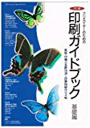
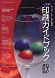
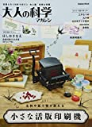
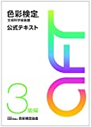

# 講義者からの推薦図書：とっぱんさん
## 関連講義
- [色彩の「し」の話・一冊の本ができるまで・印刷の基礎技術と歴史](../text/05.html)

## 講義参考図書
|  書籍画像  |  タイトル  |  販売リンク  |
| ---- | ---- |  ----  |
|    |  明解クリエイターのための印刷ガイドブック (基礎編)  |  [Amazon](https://amzn.to/2JcIeug)  |
|    |  明解クリエイターのための印刷ガイドブック (DTP基礎編)   |  [Amazon](https://amzn.to/37nIWwr)  |
|  画像はありません  |  印刷博物館ガイドブック  |  [https://ci.nii.ac.jp/ncid/BA72125005](https://ci.nii.ac.jp/ncid/BA72125005)  |
|    |  小さな活版印刷機 (大人の科学マガジンシリーズ)  |  [Amazon](https://amzn.to/3qbvuo9)  |
|    |  色彩検定 公式テキスト 3級編 (2020年改訂版)   |  [Amazon](https://amzn.to/3mmwh3b)  |