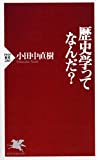
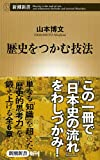
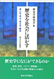
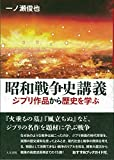
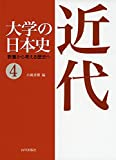

# 講義者からの推薦図書：カエデさん
## 関連講義
- [FF14と歴史学](../text/e01.html)

## 講義参考図書
|  書籍画像  |  タイトル  |  販売リンク  |
| ---- | ---- |  ----  |
|    |  歴史学ってなんだ?  |  [Amazon](https://amzn.to/3q4xlLj)  |
|    |  歴史をつかむ技法  |  [Amazon](https://amzn.to/37bFEwf)  |
|    |  歴史を社会に活かす: 楽しむ・学ぶ・伝える・観る  |  [Amazon](https://amzn.to/39nSD0D)  |
|    |  大学の日本史―教養から考える歴史へ〈4〉近代  |  [Amazon](https://amzn.to/3mcrXUh)  |
|    |  昭和戦争史講義: ジブリ作品から歴史を学ぶ  |  [Amazon](https://amzn.to/3o3uK2m)  |
|    |  東大教師が新入生にすすめる本 2  |  [Amazon](https://amzn.to/2JbtCe5)  |