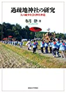
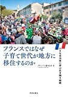

# 講義者からの推薦図書：こたるるさん
## 関連講義
- [第1回エオルゼア大学フォーラム「過疎化の現状」「????」](../text/17.html)

## 講義参考図書
|  書籍画像  |  タイトル  |  販売リンク  |
| ---- | ---- |  ----  |
|    |  過疎地神社の研究 人口減少社会と神社神道  |  [Amazon](https://amzn.to/360NLwe)  |
|    |  過疎地域の変貌と山村の動向  |  [Amazon](https://amzn.to/370yriC)  |
|    |  フランスではなぜ子育て世代が地方に移住するのか: 小さな自治体に学ぶ生き残り戦略  |  [Amazon](https://amzn.to/3l1fYaJ)  |