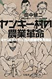
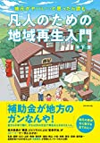
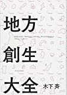

# 講義者からの推薦図書：えりゅさん
## 関連講義
- [第1回エオルゼア大学フォーラム「過疎化の現状」「????」](../text/17.html)

## 講義参考図書
|  書籍画像  |  タイトル  |  販売リンク  |
| ---- | ---- |  ----  |
|    |  ヤンキー村の農業革命  |  [Amazon](https://amzn.to/365UbKV)  |
|    |  地元がヤバい…と思ったら読む 凡人のための地域再生入門  |  [Amazon](https://amzn.to/3fw8Vpf)  |
|    |  地方創生大全  |  [Amazon](https://amzn.to/35XNOJo)  |