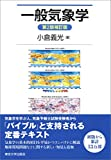
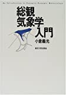
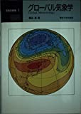
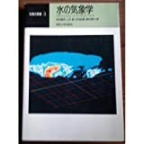
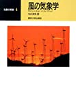
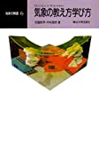

# 講義者からの推薦図書：あまねくあまにたさん
## 関連講義
- [意外と知らないお天気用語入門編](../text/15.html)

## 講義参考図書
|  書籍画像  |  タイトル  |  販売リンク  |
| ---- | ---- |  ----  |
|    |  一般気象学 第2版補訂版  |  [Amazon](https://amzn.to/2IVVBPj)  |
|    |  総観気象学入門   |  [Amazon](https://amzn.to/2J5gTtx)  |
|    |  グローバル気象学 (気象の教室)   |  [Amazon](https://amzn.to/3mfBOZD)  |
|    |  ローカル気象学 (気象の教室)  |  [Amazon](https://amzn.to/39bVNV3)  |
|    |  水の気象学 (気象の教室)  |  [Amazon](https://amzn.to/3pV6NMx)  |
|    |  風の気象学 (気象の教室)  |  [Amazon](https://amzn.to/3m4z6pv)  |
|    |  気象の数値シミュレーション (気象の教室)  |  [Amazon](https://amzn.to/33e4tH0)  |
|    |  気象の教え方学び方 (気象の教室)   |  [Amazon](https://amzn.to/3nVqQZI)  |