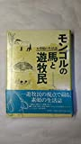
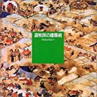
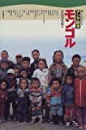
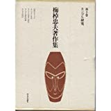
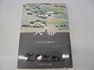

# 講義者からの推薦図書：ユルツェルさん
## 関連講義
- [モンゴルに学ぶアジムステップ民族誌](../text/08.html)

## 講義参考図書
|  書籍画像  |  タイトル  |  販売リンク  |
| ---- | ---- |  ----  |
|    |  モンゴルの馬と遊牧民 - 大草原の生活誌  |  [Amazon](https://amzn.to/35XYnMl)  |
|    |  遊牧民の建築術 - ゲルのコスモロジー  |  [Amazon](https://amzn.to/2J32pKU)  |
|    |  暮らしがわかるアジア読本（モンゴル）  |  [Amazon](https://amzn.to/3m0NS0A)  |
|    |  梅棹忠夫著作集 (第2巻) モンゴル研究  |  [Amazon](https://amzn.to/3nSDt7y)  |
|    |  天幕―遊牧民と狩猟民のすまい  |  [Amazon](https://amzn.to/3nOz1qs)  |