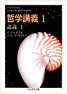
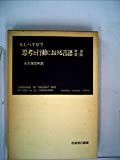
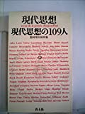
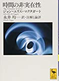
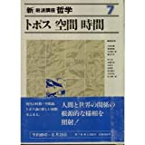

# 講義者からの推薦図書：ケイさん
## 関連講義
- [西洋哲学史講座](../text/03.html)
- [J・マクタガート時間論](../text/20.html)

## 講義参考図書
### 西洋哲学史講座
|  書籍画像  |  タイトル  |  販売リンク  |
| ---- | ---- |  ----  |
|    |  哲学講義Ⅰ認識  |  [Amazon](https://amzn.to/3pVA2Ps)  |
|    |  思考と行動における言語-原書第三版  |  [Amazon](https://amzn.to/2V90reB)  |
|    |  現代思想の108人(現代思想臨時増刊号 第六巻第八号)  |  [Amazon](https://amzn.to/3717QSB)  |

### J・マクタガート時間論
|  書籍画像  |  タイトル  |  販売リンク  |
| ---- | ---- |  ----  |
|    |  FOR BEGINNERSシリーズ 87ハイデガー  |  [Amazon](https://amzn.to/3m21pVs)  |
|    |  時間の非実在性  |  [Amazon](https://amzn.to/3nS4pEI)  |
|    |  新・岩沢講座　哲学7 トポス　空間　時間  |  [Amazon](https://amzn.to/33cEkbz)  |